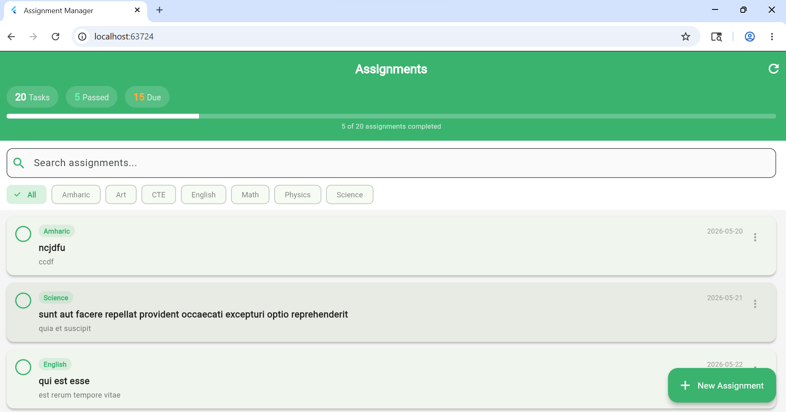
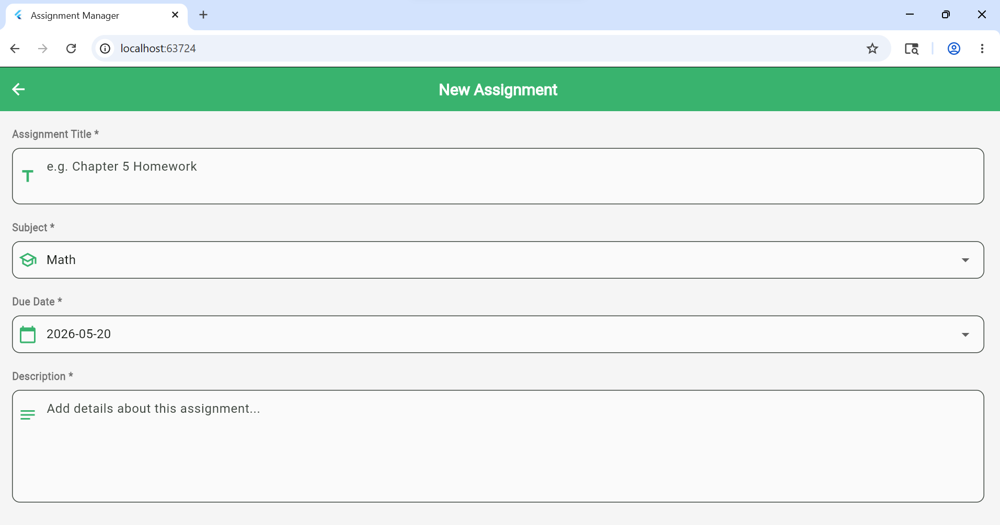
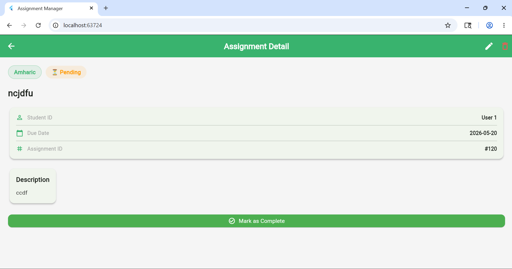
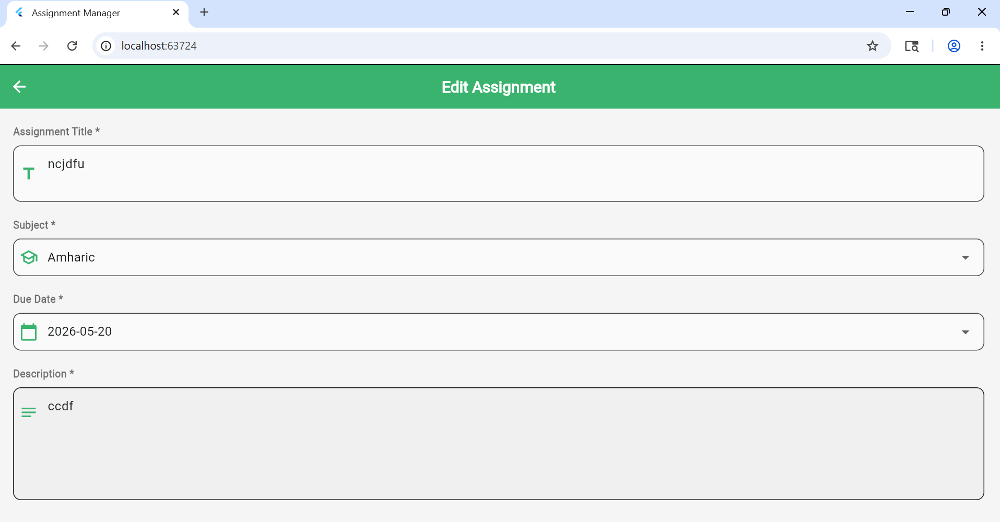

# Student Assignment Manager

## Description

Student Assignment Manager is a mobile application that allows students to manage their assignments. The app connects to the JSONPlaceholder REST API to perform full CRUD operations,Create, Read, Update, and Delete assignments. Each assignment contains a title, subject, due date, description, and completion status. Students can search assignments by title, filter by subject, and track their progress through a completion progress bar.

## Screenshots

| Home Screen | Add Assignment |
|-------------|----------------|
|  |  |

| Detail Screen | Edit Assignment |
|---------------|-----------------|
|  |  |

## Name
Amiel Abebe
UGR/5619/16
Section : 1